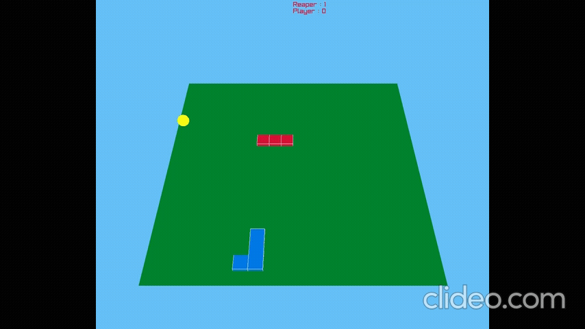

# Snake Game 3

A 3D Snake game built with C++ and Raylib featuring a BFS-powered AI opponent named Reaper. Unlike traditional Snake games, players compete against an intelligent AI that continuously computes the shortest path to food while avoiding obstacles and both snake bodies.

## Demo

## Features

* 3D gameplay using Raylib
* Grid-based movement system
* Dynamic food spawning
* Snake growth mechanics
* Self-collision detection
* Wall collision detection
* Real-time score tracking
* Competitive AI opponent (Reaper)
* Breadth-First Search (BFS) pathfinding

## Controls

| Key | Action     |
| --- | ---------- |
| W   | Move Up    |
| A   | Move Left  |
| S   | Move Down  |
| D   | Move Right |

## AI Pathfinding

Reaper uses Breadth-First Search (BFS) to locate the shortest available path to food.

For every move:

1. A blocked-cell grid is generated.
2. Player and AI body segments are marked as obstacles.
3. BFS searches for the shortest path to the food.
4. The path is reconstructed using parent tracking.
5. Reaper follows the next step in the computed route.

This allows the AI to dynamically react to changing board states and compete with the player in real time.

## Technologies Used

* C++
* Raylib
* STL (`vector`, `queue`, `pair`)
* Breadth-First Search (BFS)
* 3D Rendering

## Technical Highlights

* 3D rendering using Raylib
* BFS graph traversal on a dynamic grid
* Path reconstruction using parent tracking
* Dynamic obstacle generation
* Real-time game loop and collision system
* Score tracking and winner determination

## What I Learned

* Working with 3D graphics using Raylib
* Implementing graph traversal algorithms in games
* Pathfinding using Breadth-First Search
* Reconstructing shortest paths using parent tracking
* Managing dynamic game objects
* Designing AI behavior in a real-time environment

## Project Evolution

Snake Game 1

* Console-based implementation
* Matrix representation using integers

Snake Game 2

* SFML graphics
* Real-time rendering and input handling

Snake Game 3

* 3D graphics with Raylib
* BFS-powered AI opponent
* Competitive gameplay

